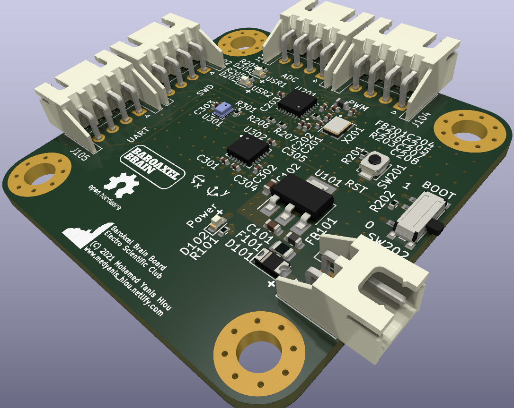
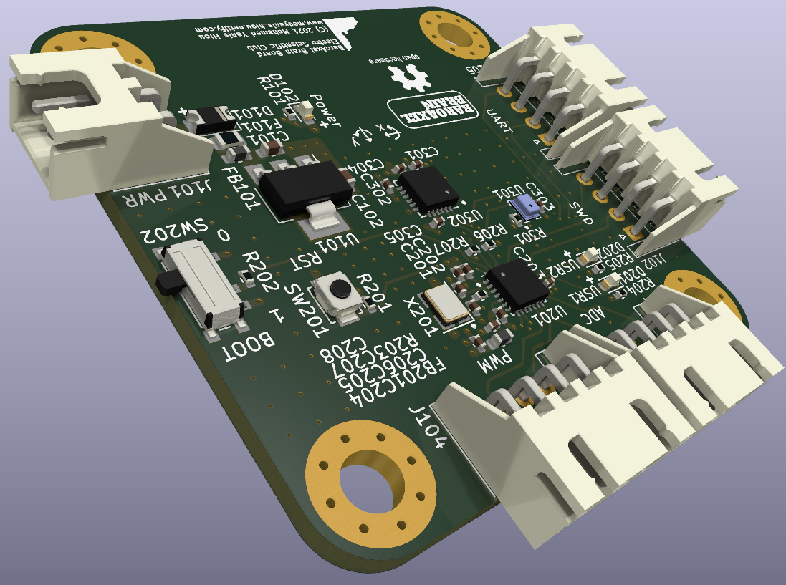

# BaroAxel Brain

[](https://techforpalestine.org/learn-more)

[](LICENSE)


This Printed Circuit Board (PCB) is based on the STM32 microcontroller as well as MEMS sensors (MPU6050 and BMP280).
The PCB is designed using the free and open source software <a href="https://github.com/KiCad">KiCad</a>. 

## More Details
BaroAxel Brain is a compact Printed Circuit Board (PCB) designed for industrial instrumentation applications. It integrates the STM32L0 series microcontroller, MPU6050 accelerometer, and BMP280 barometer, providing a comprehensive solution for asynchronous motor anomaly detection and other MEMS-based applications.

This board operates with a wide input voltage range from 4.75V to 12V, ensuring compatibility with various power sources commonly found in industrial environments. It features multiple connectors for UART communication, analog-to-digital conversion, and timer functions, offering flexibility for interfacing with diverse sensors and peripherals.

The STM32L0 MCU, renowned for its low-power operation and high-performance computing capabilities, drives the board's functionality. The integrated MPU6050 accelerometer enables precise measurement of acceleration, essential for monitoring vibrations and detecting anomalies in industrial machinery. Additionally, the BMP280 barometer facilitates accurate measurement of atmospheric pressure, enabling environmental monitoring in diverse industrial settings.

The compact design of BaroAxel Brain optimizes space utilization, making it suitable for integration into space-constrained industrial systems while maximizing functionality. It also includes an SWD connector for firmware updates, ensuring easy maintenance and scalability of the board.

This combination of features makes BaroAxel Brain an ideal choice for applications requiring robust industrial instrumentation, such as asynchronous motor anomaly detection and drone instrumentation, among others.

This board is designed back to 2021, ordered in 2023, and hand soldered in April 2024<br><br>


## Features :dart:
* [x] Four layers PCB
* [x] Low power
* [x] Small size (50x50mm)
* [x] Very easy to use

## Thank _You_!
Please :star: this repo to help us improve the quality.
<br><br>

## PCB Block Diagram
PCB System Block
:---------------------:


## 3D Viewer
Front View           | Back View
:---------------------:|:------------------:
 | 
Side View 1         |  Side View 2
 | 
Side View 3         |  Side View 4
 | 


## Before, During and After Soldering
Before           | Before
:---------------------:|:------------------:
 | 
During         |  During
 | 
After         |  After
 | 


## Requirements

If you want to review the PCB or yoou wanna edit the schematics/layout, yoou only need to install KiCad software to your machine.

* Go to the <a href="https://www.kicad.org/download/">Official KiCad Download Page</a>.
* Select your operating system.
* Download the executable file and install it.

## Documentations
Open the [Datasheets](Datasheets) folder and you will find all the datasheets, applications notes, and design guidelines that help you understand the design better.


## How To Use It

1. Install this repository, click <a href="https://github.com/mohamedyanis/BaroAxel-Brain/archive/master.zip"> here </a> to install it. Or use git command:
```bach
git clone https://github.com/mohamedyanis/BaroAxel-Brain.git
```
3. Extract the folder and open it.
4. Navigate for the [Manufacturing](Manufacturing) folder.
5. Go to your best PCB manufacturer website and click on quote.
6. Upload the [BaroAxel_Brain_Gerber.rar](Manufacturing/Gerber/BaroAxel_Brain_Gerber.rar) in order to order the board.

## License
The content of this project is licenced under the [BSD 3-Clause "New" or "Revised" License](LICENSE).

## Contributing 💡
If you want to contribute to this project and make it better with new ideas, your pull request is very welcomed.<br>
If you find any issue just put it in the repository issue section, thanks!<br><br>
.سبحَانَكَ اللَّهُمَّ وَبِحَمْدِكَ، أَشْهَدُ أَنْ لا إِلهَ إِلأَ انْتَ أَسْتَغْفِرُكَ وَأَتْوبُ إِلَيْكَ
